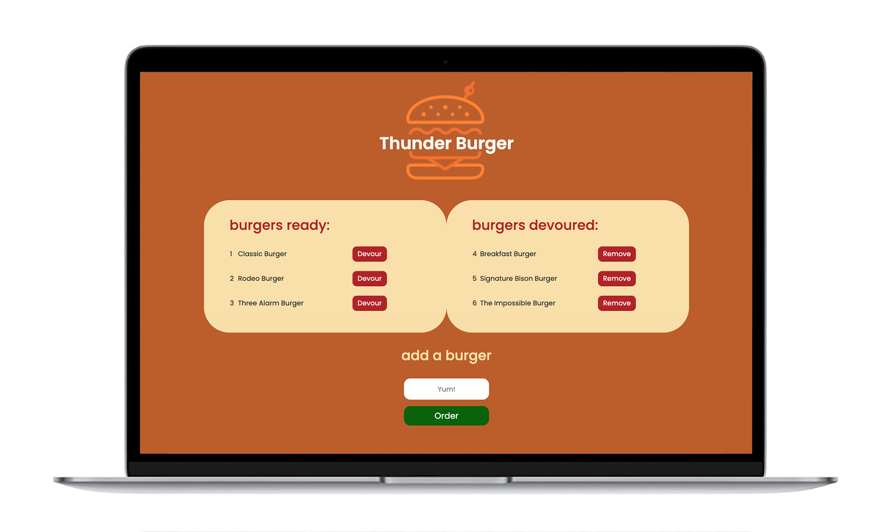

# Thunder Burger App

  ## Description
  Welcome to **Thunder Burger!** This is a restaurant app where burger lovers can order their favorite burgers and devour them as fast as one click! A burger restaurant business using this application will be able to keep track of burgers being ordered, devoured and removed from the burger slate.

  The **Thunder Burger** has been created with **MySQL Workbench**, **JavaScript**, **Node.js**, **Express.js**, **Handlebars** and **ES6+**, the following **NPM** packages: [**MySQL**](https://www.npmjs.com/package/mysql), [**Express**](https://www.npmjs.com/package/express), and [**Express-Handlebars**](https://www.npmjs.com/package/express-handlebars) as dependencies.

  

    ## Table of Contents
  - [Installation](#installation)
  - [Usage](#usage)
  - [License](#license)
  - [Contributing](#contributing)
  - [Questions](#questions)

  ## Installation
  **Thunder Burger** is hosted on heroku, no special installation is required.

  ## Usage
  How this application can be used: To see the deployed application [CLICK HERE.](https://thunder-burger-app.herokuapp.com/)


  - - -

  ## License
    MIT

  ## Contributing
    Jon Phoenix


- - -

  ## Questions
  
 
  
 
  
 Application repository: https://github.com/JonPhoenix/employee-tracker
  
 For further questions, please contact the author at: jonphx@uw.edu

- - -

  ## References
  ```
  * w3schools.com
  * developer.mozilla.org
  * mysql.com

  * nodejs.org
  * node.readthedocs.io
  * npmjs.com

  * heroku.com

  ```
  - - -
